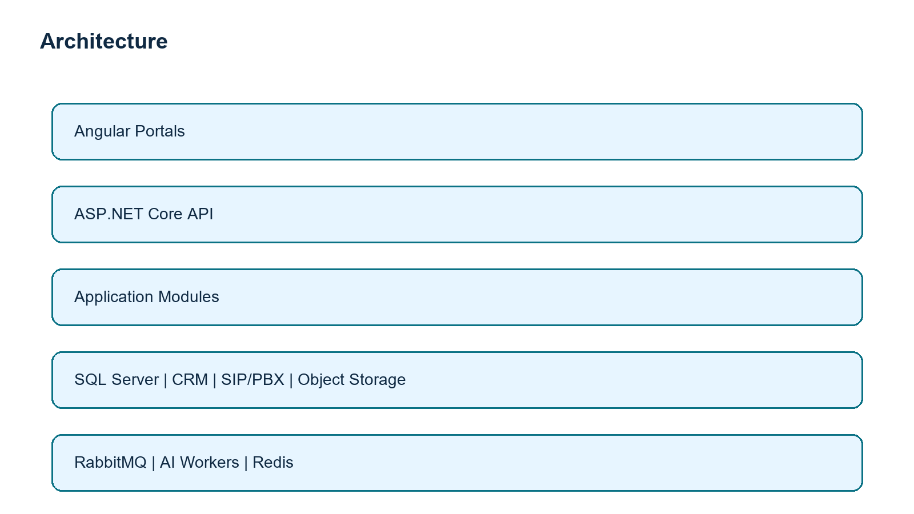

# Requirement Analysis

## Context and goals
The company is replacing a third-party call-center product with an on-premises platform using BTCL numbers and CRM APIs. The business needs reliable inbound and outbound communication, fair call distribution, agent and team visibility, recordings, quality assurance, and a controlled route to future AI. Success means a secure MVP for 50+ agents that can grow to 500+ agents, multiple teams, campaigns, and higher call volume without rewriting core domain rules.

## Stakeholders
| Stakeholder | Decision or need |
| --- | --- |
| Executive sponsor | Cost, service quality, risk and roadmap outcomes |
| Contact-center manager | Queues, teams, campaigns, service levels and reporting |
| Agents and supervisors | Usable desktop, presence, call controls and coaching |
| Customers | Reliable, respectful, timely communication |
| CRM owner | Stable data contract, ownership and data-quality controls |
| IT operations and security | On-premises operation, identity, backup, monitoring and access control |
| BTCL/PBX provider | Number provisioning, SIP trunks, codec, capacity and incident path |
| Compliance/legal | Recording consent, retention, access and audit requirements |

## Assumptions
BTCL connectivity is exposed through a SIP-compatible carrier/PBX; the CRM has authenticated APIs and stable customer IDs; staff use modern browsers and managed headsets; recording consent and retention policy will be approved before production; production has redundant network, compute, and backup capacity. These assumptions are validation items, not settled facts.

## Functional requirements
1. Authenticate users and authorize agent, supervisor, administrator, and QA roles.
2. Maintain agents, teams, skills, queues, campaigns, dispositions and schedules.
3. Receive inbound calls, identify the caller through CRM, route by queue/skill/availability, and surface a screen-pop.
4. Initiate governed outbound calls, associate them with a customer and campaign, and record the outcome.
5. Track a call lifecycle, transfers, holds, callbacks, dispositions, recording metadata and audit events.
6. Provide live supervisor queue/agent visibility and historical operational and quality reports.
7. Store recordings outside the transaction database and protect playback by authorization and audit.
8. Synchronize call activity to CRM reliably with retries and idempotency.

## Non-functional requirements
| Area | Initial target |
| --- | --- |
| Availability | 99.9% monthly for the web/control plane, with PBX failover separately agreed |
| Performance | 95% of portal API reads under 300 ms excluding CRM/PBX latency |
| Security | TLS, JWT/OIDC integration path, least privilege, secrets outside source control, audited recording access |
| Reliability | Idempotent events, retry/backoff, durable outbox and dead-letter handling for integrations |
| Observability | Structured logs, metrics, traces, health checks and alert runbooks |
| Recovery | Tested backup restore; defined RPO/RTO after stakeholder agreement |
| Maintainability | Clean dependency direction, versioned APIs and automated CI |

## Risks and mitigations
Carrier/PBX ambiguity is the highest technical risk; validate it with a SIP proof of connectivity. CRM latency/outages require timeouts, circuit breaking and queued sync. Recording policy and customer consent require legal sign-off. Load uncertainty requires call-volume measurement and capacity tests. Scope growth is contained through an explicit MVP and phased roadmap.

## Out of scope for MVP
Predictive dialing, workforce management, billing, native mobile apps, multilingual IVR, advanced QA automation, AI transcription/summary/assistance, cross-region active-active operation, and replacing CRM customer-master ownership are excluded.

# Stakeholder Questions

## Business and operations
1. Which customer journeys and queues have priority at launch?
2. What service-level, abandonment, occupancy and quality targets define success?
3. Which roles can transfer, listen, barge, download recordings, or change routing?
4. Which campaigns require preview, progressive, or manual dialing?
5. What is the approved disposition taxonomy and callback ownership rule?

## Telephony
1. Does BTCL provide SIP trunks directly or through an approved PBX/SBC, and who owns each layer?
2. What codecs, concurrent call capacity, DDI ranges, emergency routing, caller-ID and number-portability rules apply?
3. Is WebRTC supported or must agents use a desk phone/softphone integration?
4. What are the transfer, hold, conference, failover and carrier incident procedures?

## CRM and data
1. Which CRM APIs, rate limits, authentication method, SLAs and sandbox are available?
2. Which system owns customer identity, consent, phone changes and interaction history?
3. What must happen when CRM is unavailable, returns a duplicate, or has no match?

## Security, compliance and scale
1. What recording-consent wording, retention period, encryption standard and legal-hold process apply?
2. Which identity provider, password/MFA, network zones and audit retention requirements apply?
3. What peak simultaneous calls, calls/hour, recording duration and growth forecast are expected?
4. What RPO/RTO, maintenance window and DR site budget are accepted?
5. Which data may be sent to a future AI provider, and is on-premises inference required?

# MVP Definition

## Included
The MVP delivers SSO/JWT-ready access control, agent/team/queue administration, inbound routing through the approved PBX adapter, controlled manual outbound calling, agent presence, caller screen-pop via CRM, call lifecycle/dispositions, recording metadata and protected playback links, supervisor queue visibility, basic reports, CRM activity sync, audit logging, health checks, and deployment automation.

## Deferred
Predictive dialer, WFM, advanced IVR, speech analytics, AI capabilities, omnichannel messaging, bespoke BI warehouse, and multi-site active-active telephony are deferred. They add integration, policy, and operational risk without being necessary to prove the initial customer-call workflow.

## Release gates
Launch follows carrier/PBX certification, CRM contract testing, recording consent approval, security review, load test at agreed peak concurrency, backup restore rehearsal, supervisor acceptance testing, and operational runbook sign-off.

The solution begins as a four-project modular monolith: Angular portals call an ASP.NET Core API whose modules enforce clean boundaries. `Domain` contains rules; `Application` contains use cases and interfaces; `Infrastructure` contains SQL Server, Dapper, CRM, recording, and SIP/PBX adapters; `API` is the composition and HTTP boundary. SQL Server holds authoritative transactional data; object storage holds recordings. RabbitMQ is introduced for durable asynchronous integration, and Redis is optional for ephemeral state at scale.

## Major components
* Agent portal: authenticated desktop for presence, caller context and call outcomes.
* Admin/supervisor portal: configuration, live operations and reporting.
* API/application modules: identity, agent administration, routing, calls, recording metadata and reporting.
* Telephony adapter: carrier/PBX-specific ingress and command boundary.
* CRM adapter: customer lookup and durable call-activity synchronization.
* Recording service: secure object-store lifecycle and authorization checks.
* Observability: Serilog, metrics, traces, health checks, alerting.

## Core data flows
Inbound: BTCL -> SBC/PBX -> telephony adapter -> routing module -> selected agent; CRM lookup provides screen-pop; lifecycle events update SQL and publish an outbox event; recording metadata is saved and CRM sync runs asynchronously. Outbound follows the inverse command path after authorization and campaign/consent validation.

# Database Design

SQL Server is the system of record for transactional metadata. Recordings remain in object storage; the database stores immutable references, hashes, retention, and access audit.

| Entity | Key relationships |
| --- | --- |
| Agent | belongs to Team; has Skills and Presence events |
| CustomerReference | maps local identity to CRM external ID |
| Queue | belongs to Team; uses QueueSkill rules |
| Campaign | owns outbound call policies and Call records |
| Call | references CustomerReference, Agent, Queue, Campaign and Recording |
| CallEvent | append-only lifecycle event for a Call |
| Recording | references Call and object storage URI; has retention state |
| AuditEvent | immutable actor/action/resource history |
| OutboxMessage | durable integration event with status and retry fields |

Use GUID keys, UTC timestamps, optimistic concurrency where configuration is contested, unique external IDs, and indexes on call start time, agent/status, queue/status, CRM ID, and outbox processing status. Partition/archive call-event and recording metadata by time as volume grows.

# API Design

The public portal API is versioned under `/api/v1`, JSON over HTTPS, and protected by bearer tokens. Commands use request validation and return problem details on failure; list endpoints are paginated and filtered. OpenAPI is generated from controllers.

| Endpoint | Purpose |
| --- | --- |
| `POST /api/v1/auth/login` | Development skeleton token issue; production integrates enterprise identity |
| `GET,POST /api/v1/agents` | List and administer agents |
| `POST /api/v1/calls/outbound` | Start an authorized outbound-call command |
| `POST /api/v1/telephony/events` | Authenticated PBX webhook ingress |
| `GET /api/v1/queues/{id}/snapshot` | Supervisor queue snapshot |
| `GET /health` | Liveness/readiness health endpoint |

Synchronous APIs are for user interaction. CRM synchronization, recording indexing, and future AI tasks use durable events with correlation IDs, idempotency keys, retry policy and dead-letter monitoring. Internal contract versions are explicit so adapters evolve independently.

# Scalability and Availability

At 50+ agents, deploy two stateless API instances behind a reverse proxy, one SQL Server primary with tested backup, a PBX/SBC pair where carrier design permits, and centralized logs. At 500+ agents, scale API instances horizontally, use Redis for presence/cache/rate limits, RabbitMQ for asynchronous workloads, separate reporting reads, partition time-series call data, and move recordings to resilient object storage.

## High availability and load balancing
Use health-checked L7 load balancing with no API session affinity; JWT and distributed state remove node dependence. Keep PBX/SBC redundancy independent from the web tier. SQL Server HA, recording-store replication, carrier failover numbers, and a documented degraded mode are architecture decisions subject to infrastructure budget. Capacity test concurrent calls, websocket connections, CRM dependency latency, and queue-routing latency before each growth milestone.

## Monitoring
Track call attempts/completions/failures, queue wait and abandonment, agent presence, PBX webhook latency, CRM error rate, recording pipeline lag, SQL saturation, message backlog and dead-letter count. Alert on user-impacting SLO burn, not only host CPU. Correlate every call through portal, PBX, CRM, recording and event logs with a call/correlation ID.

# AI Readiness

AI is not part of the MVP. The architecture prepares for it by retaining consent and recording metadata, producing immutable call events, storing recordings by reference, and publishing a versioned `CallCompleted` event. An isolated AI worker can consume a copy of permitted audio, create a transcript/summary/QA score with model/version/provenance, and write derived artifacts separately from the original call record.

AI agent assistance and routing remain advisory until measurable quality, bias, latency, privacy, and human-override controls are accepted. The design requires consent policy enforcement before export, encryption in transit/at rest, prompt/data minimization, retention deletion propagation, evaluation datasets, audit trails, and an on-premises/approved-provider deployment decision. Routing recommendations must expose confidence and reason codes and always permit supervisor override.

# Deployment Strategy

## Environments
Development uses Docker Compose, mockable CRM/PBX adapters, synthetic data and non-production secrets. Staging mirrors production topology sufficiently for integration, security, restore, and load testing. Production uses segregated network zones, managed secrets, TLS, redundant API/PBX paths, protected SQL/object storage, and least-privilege service identities.

## CI/CD and rollback
CI restores, builds, tests, scans dependencies, validates diagrams/docs, builds immutable container images and publishes versioned artifacts. CD promotes the exact artifact through staging to production with approval and health checks. Database changes are backward-compatible expand/migrate/contract releases. Rollback selects the last known-good image; a migration rollback is only used when explicitly tested, otherwise forward-fix restores compatibility.

## Backup and recovery
Perform encrypted SQL full/differential/log backups to a separate failure domain; version recordings and configuration; test restore at an agreed cadence. Document and rehearse RPO/RTO, carrier failover, CRM outage, message backlog recovery, and credential compromise runbooks.

